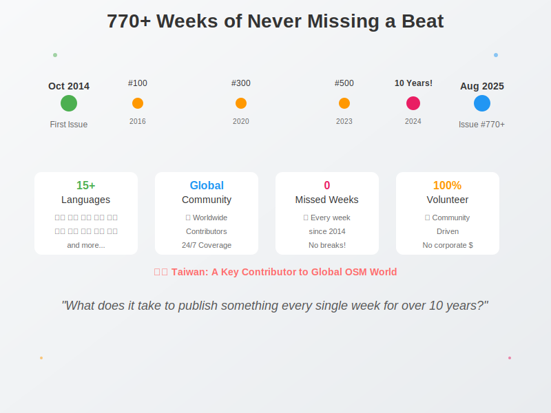
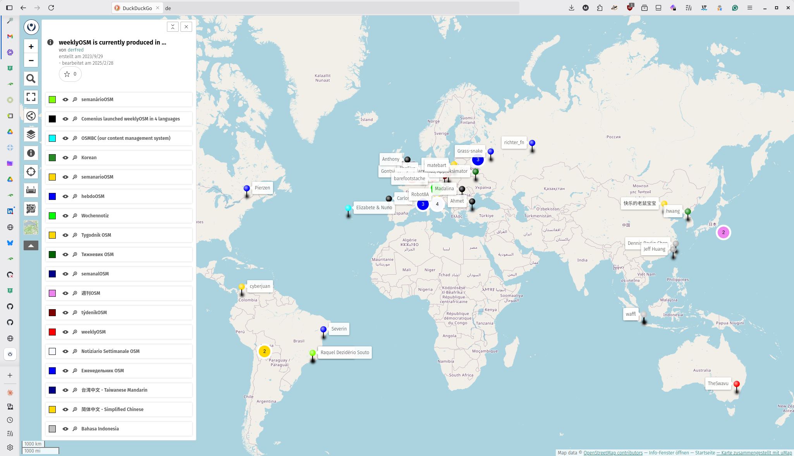
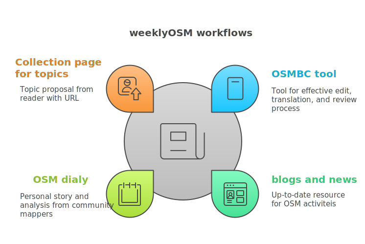
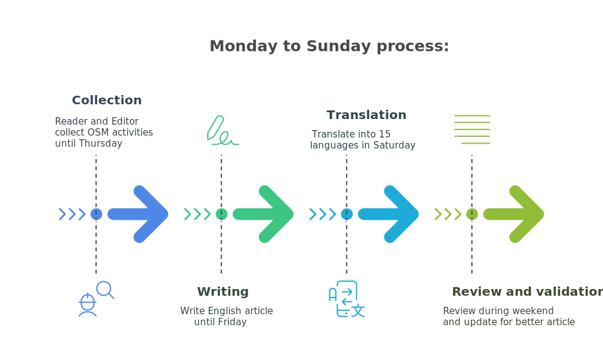
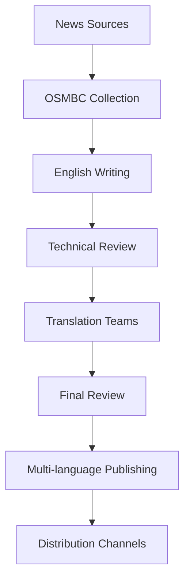
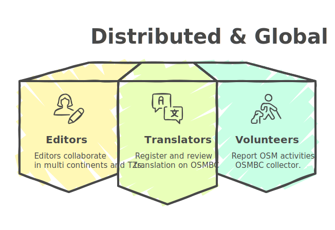

<!-- Title Slide -->
<!-- _class: gaia lead -->
<!-- _paginate: false -->
<!-- _header: '' -->
<!-- _footer: '' -->


#### Behind the Scenes of
#  <span style="color: purple;">weeklyOSM</span>
#### How We Share OSM News Every Week
### Hiroshi Miura, OSM Foundation Japan

---

## Agenda
1. 770+ Weeks of Never Missing a Beat
2. What is weeklyOSM?
3. Taiwan's Role in the Global Story
4. The Magic Behind the Curtain
5. Technical Deep Dive: OSMBC Tool
6. Challenges & Solutions
7. Join the Story

---

<!-- Opening Hook -->



---

## 770+ Weeks of Never Missing a Beat

**October 2014 → August 2025**
- **770+ issues published**
- **15+ languages**
- **Zero missed weeks**
- **Global volunteer network**

*What does it take to publish something every single week for over 10 years?*

---



## The Global Pulse of OpenStreetMap

- **Connecting mappers worldwide**
- **Local stories → Global impact**
- **Community heartbeat**
- **Volunteer-driven journalism**

---

<!-- What is weeklyOSM -->


## What is weeklyOSM?

**OSM's Weekly News Source**
- For **everyone** - beginners to experts
- **15 languages** (translation volunteers essential)
- **Independent** from organizations/companies
- **52 issues per year** (no breaks!)

**https://weeklyosm.eu/**

---

## More Than Just News


- **Community spotlight**
- **Technical developments**
- **Local mapping projects**
- **Tool announcements**
- **Event coverage**
- **Educational content**

---

<!-- Taiwan's Role -->


## Taiwan's Role in the Global Story

**Small Island, Big Impact**
- Active translation team
- Local community events → international news
- Bridge between APAC communities
- Cultural adaptation expertise
- Night markets to global maps

---

### Taiwan Community Contributions


**Recent Taiwan Features:**
- Typhoon response mapping
- Night market mapping projects
- Community meetup coverage
- Technical tool contributions
- Cultural site documentation

*From local knowledge to global audience*

---

<!-- Technical Deep Dive -->

## The Magic Behind the Curtain



**News Collection Process**
- OSM diaries monitoring
- Community channels scanning
- Social media tracking
- Direct submissions

---

## Meet OSMBC: Our Secret Weapon


**OSMBC Tool Features:**
- Collaborative news collection
- Multi-language workflow
- Review and approval system
- Publishing automation
- Version control for articles

**Live Demo Time!**

---

### The Weekly Workflow



**Monday-Sunday Process:**
- Collection → Writing → Review → Translation → Publishing
- Cross-timezone coordination
- Quality assurance at every step

---

### Technical Architecture



**Built on:**
- Node.js backend
- Collaborative editing interface
- Git-based version control
- Automated publishing pipeline

---

## Translation Workflow Deep Dive


**Professional Translation Process:**
- **OmegaT** (Computer-Aided Translation)
- Translation memories
- Terminology management
- Quality assurance checks
- Cultural adaptation

---

### Translation Demo

<iframe src="https://player.vimeo.com/video/1054512440?badge=0&amp;autopause=0&amp;player_id=0&amp;app_id=58479" width="700" height="390" frameborder="0" allow="autoplay; fullscreen; picture-in-picture; clipboard-write; encrypted-media" title="OSMBC Demo"></iframe>

**Tools in Action:**
- Real-time collaboration
- Quality control processes
- Cross-language coordination

---

<!-- Team Structure -->

## weeklyOSM Team Structure



**Distributed Global Team:**
- Editorial coordinators
- Language team leads
- Technical reviewers
- Translation volunteers

---

<!-- Challenges -->

## The Real Challenges

**Weekly Pressure Cooker:**
- 🕒 **Tight deadlines** - every single week
- 🌍 **Timezone coordination** across continents
- 👥 **Volunteer management** - life happens
- 🔄 **Consistent quality** with rotating contributors

---

## Technical Challenges & Solutions

**Infrastructure Issues:**
```yaml
Challenges:
  - Server maintenance during production
  - Multi-language encoding issues
  - Large media file handling
  - Cross-platform compatibility

Solutions:
  - Automated backup systems
  - Unicode standardization
  - CDN for media distribution
  - Progressive web app architecture
```

---

## Community Challenges

**Human Factors:**
- **Contributor lifecycle** - onboarding to retention
- **Burnout prevention** - sustainable volunteering
- **Knowledge transfer** - preserving institutional memory
- **Quality vs. speed** - maintaining standards under pressure

**Our Approach:**
- Mentorship programs
- Flexible commitment levels
- Documentation-first culture
- Community support networks

---

<!-- Success Stories -->

## Success Stories from Taiwan


**Impact Examples:**
- Local typhoon mapping → global disaster response patterns
- Night market documentation → cultural mapping guidelines
- Community tool development → international adoption
- Translation innovations → multilingual best practices

---

<!-- Looking Forward -->

## The Future of Community News

**Technology Opportunities:**
- AI-assisted translation (with human oversight)
- Automated content aggregation
- Real-time collaboration improvements
- Mobile-first editing experience

**Community Growth:**
- More regional contributors
- Specialized topic coverage
- Interactive content formats
- Video/multimedia integration

---

## Lessons Learned (10+ Years)

**What Works:**
✅ Consistent schedule builds habit
✅ Quality over quantity
✅ Community ownership
✅ Technical tools enable scale
✅ Cultural sensitivity matters

**What's Hard:**
❌ Sustainable volunteer engagement
❌ Technical debt management
❌ Keeping content fresh
❌ Balancing depth vs accessibility

---

<!-- Call to Action -->

## Join the Story - Multiple Ways to Contribute

**For Developers:**
- OSMBC tool improvements
- Translation workflow automation
- Mobile app development
- Analytics and metrics

**For Writers:**
- Article writing and editing
- Technical documentation
- Community story coverage
- Interview coordination

---

## Join the Story - Taiwan Specific

**For Taiwan Community:**
- 🇹🇼 **Translation team** - help with Traditional Chinese
- 📰 **Local news gathering** - share Taiwan OSM activities
- 🔧 **Technical contributions** - improve tools and processes
- 🎤 **Community liaison** - connect local and global stories

**Get Started:**
- Email: taiwan@weeklyosm.eu
- Telegram: @WeeklyOSM_Taiwan
- GitHub: github.com/weeklyOSM

---

## Technical Contribution Opportunities

```javascript
// Example: OSMBC Enhancement Ideas
const contributionOpportunities = {
  frontend: [
    "Mobile-responsive editing interface",
    "Real-time collaboration features",
    "Improved translation workflow UI"
  ],
  backend: [
    "API improvements",
    "Automated content aggregation",
    "Performance optimizations"
  ],
  infrastructure: [
    "CI/CD pipeline enhancements",
    "Monitoring and alerting",
    "Scalability improvements"
  ]
};
```

---

## Resources & Next Steps


**Links:**
- 📰 weeklyOSM: https://weeklyosm.eu/
- 🛠️ OSMBC tool: https://osmbc.openstreetmap.de/
- 💬 Contribute: https://weeklyosm.eu/en/contribute
- 📧 Contact: weeklyosm@openstreetmap.de

**This Presentation:**
- Slides: [your-github-url]
- Source: [your-repo-url]

---

<!-- Closing -->
<!-- _class: gaia lead -->
<!-- _paginate: false -->
<!-- _header: '' -->
<!-- _footer: '' -->


# Every Week, Every Community, Every Mapper

## Thank You!
### Questions & Discussion

**Let's keep the OSM world connected**

---

<!-- Backup Slides -->

## Backup: Technical Stack Details

**Frontend:**
- Vue.js for reactive UI
- Bootstrap for responsive design
- Monaco Editor for code editing

**Backend:**
- Node.js with Express
- PostgreSQL for data storage
- Redis for caching

**Infrastructure:**
- Docker containers
- Nginx reverse proxy
- Automated SSL certificates

---

## Backup: Translation Statistics

| Language | Contributors | Issues Translated | Completion Rate |
|----------|-------------|-------------------|----------------|
| German   | 15          | 770+              | 100%           |
| French   | 12          | 750+              | 97%            |
| Japanese | 8           | 600+              | 78%            |
| Chinese  | 6           | 400+              | 52%            |
| Spanish  | 10          | 500+              | 65%            |

**Taiwan contributors are crucial for Chinese translations!**

<script src="https://player.vimeo.com/api/player.js"></script>
<script type="module">
  import mermaid from 'https://cdn.jsdelivr.net/npm/mermaid@10/dist/mermaid.esm.min.mjs';
  mermaid.initialize({ startOnLoad: true });
</script>-
