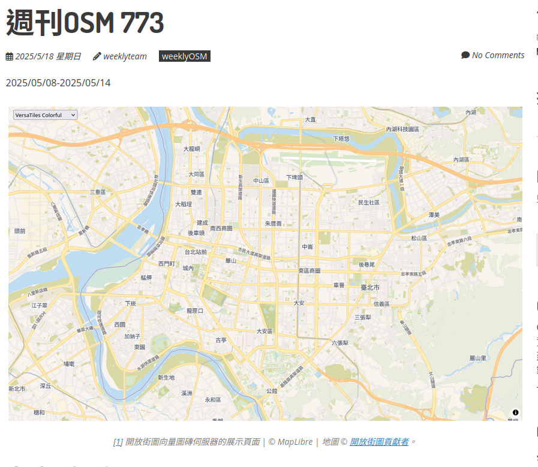
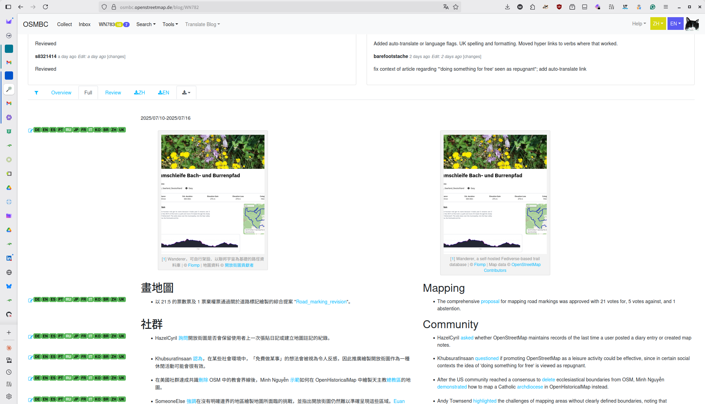

<!-- Title Slide -->
<!-- _class: gaia lead -->
<!-- _paginate: false -->
<!-- _header: '' -->
<!-- _footer: '' -->


#### Behind the Scenes of
#  <span style="color: purple;">weeklyOSM</span>
#### How We Share OSM News Every Week
### Hiroshi Miura, OSM Foundation Japan

---

## Agenda
1. The fact of 780+ Weeks
2. What is weeklyOSM?
4. The Magic Behind the Curtain
5. Deep Dive: OSMBC Tool
6. My Challenge: productivity
7. Join the Story

---

<!-- Opening Hook -->

## 770+ Weeks of 
## Never Missing a Beat

---


---


## The Global Pulse of OpenStreetMap

- **Connecting mappers worldwide**
- **Local stories → Global impact**
- **Community heartbeat**
- **Volunteer-driven journalism**

---


---

<!-- What is weeklyOSM -->


## What is weeklyOSM?

**OSM's Weekly News Source**
- For **everyone** - beginners to experts
- **15 languages** (translation volunteers essential)
- **Independent** from organizations/companies
- **52 issues per year** (no breaks!)

**https://weeklyosm.eu/**

---

## More Than Just News


- **Community spotlight**
- **Technical developments**
- **Local mapping projects**
- **Tool announcements**
- **Event coverage**
- **Educational content**

---

<!-- Taiwan's Role -->


## Taiwan's Role in the Global Story

**Small Island, Big Impact**
- Active translation team
- Local community events → international news
- Bridge between APAC communities
- Cultural adaptation expertise
- Night markets to global maps

---

### Taiwan Community Contributions



**Recent Taiwan Features:**
- Wikidata Taiwan collaboration in #763, #773
- Mapper interview in #665
- Night market mapping projects
- Community meetup coverage

*From local knowledge to global audience*

---

<!-- Technical Deep Dive -->

## Behind the Curtain


<!--
**News Collection Process**
- OSM diaries monitoring
- Community channels scanning
- Social media tracking
- Direct submissions
-->

---

## Meet OSMBC: Our Secret Weapon



**OSMBC Tool Features:**
- Collaborative news collection
- Multi-language workflow
- Review and approval system
- Publishing automation
- Version control for articles

**Live Demo Time!**

---

### The Weekly Workflow


**Monday-Sunday Process:**
- Collection → Writing → Review → Translation → Publishing
- Cross-timezone coordination
- Quality assurance at every step

---

### Technical Workflow

- Gather and write article
<div class="mermaid">
graph LR
    A[News Sources] --> B[OSMBC Collection]
    B --> C[English Writing]
    C --> D[Fact checks]
    style A fill:#fff2b2,stroke:#333
    style B fill:#fff2b2,stroke:#333
    style C fill:#fff2b2,stroke:#333
    style D fill:#fff2b2,stroke:#333
</div>

- Translate article
<div class="mermaid">
graph LR
    A[Content] --> B[Translation]
    B --> C[Review and comments]
    C --> D[Multi-language Publish]
    style A fill:#e6e6fa,stroke:#333
    style B fill:#e6e6fa,stroke:#333
    style C fill:#e6e6fa,stroke:#333
    style D fill:#e6e6fa,stroke:#333
</div>

---

## My challenge: productivity


**Professional Translation Process:**
- **OmegaT** (Computer-Aided Translation)
- Translation memories
- Terminology management
- Quality assurance checks

---

### Translation Demo

<iframe src="https://player.vimeo.com/video/1054512440?badge=0&amp;autopause=0&amp;player_id=0&amp;app_id=58479" width="700" height="390" frameborder="0" allow="autoplay; fullscreen; picture-in-picture; clipboard-write; encrypted-media" title="OSMBC Demo"></iframe>


---

<!-- Team Structure -->

## weeklyOSM Team Structure


**Distributed Global Team:**
- Editorial coordinators
- Language team leads
- Technical reviewers
- Translation volunteers

---

<!-- Challenges -->

## The Real Challenges

**Weekly Pressure Cooker:**
- 🕒 **Tight deadlines** - every single week
- 🌍 **Timezone coordination** across continents
- 👥 **Volunteer management** - life happens
- 🔄 **Consistent quality** with rotating contributors

---

## Technical Challenges & Solutions

**Infrastructure Issues:**
```yaml
Challenges:
  - Server maintenance during production
  - Multi-language encoding issues
  - Large media file handling
  - Cross-platform compatibility

Solutions:
  - Automated backup systems
  - Unicode standardization
  - CDN for media distribution
  - Progressive web app architecture
```

---

## Community Challenges

**Human Factors:**
- **Contributor lifecycle** - onboarding to retention
- **Burnout prevention** - sustainable volunteering
- **Knowledge transfer** - preserving institutional memory
- **Quality vs. speed** - maintaining standards under pressure

**Our Approach:**
- Mentorship programs
- Flexible commitment levels
- Documentation-first culture
- Community support networks

---

<!-- Success Stories -->

## Success Stories from Taiwan


**Impact Examples:**
- Local typhoon mapping → global disaster response patterns
- Night market documentation → cultural mapping guidelines
- Community tool development → international adoption
- Translation innovations → multilingual best practices

---

<!-- Looking Forward -->

## The Future of Community News

**Technology Opportunities:**
- AI-assisted translation (with human oversight)
- Automated content aggregation
- Real-time collaboration improvements
- Mobile-first editing experience

**Community Growth:**
- More regional contributors
- Specialized topic coverage
- Interactive content formats
- Video/multimedia integration

---

## Lessons Learned (10+ Years)

**What Works:**
✅ Consistent schedule builds habit
✅ Quality over quantity
✅ Community ownership
✅ Technical tools enable scale
✅ Cultural sensitivity matters

**What's Hard:**
❌ Sustainable volunteer engagement
❌ Technical debt management
❌ Keeping content fresh
❌ Balancing depth vs accessibility

---

<!-- Call to Action -->

## Join the Story - Multiple Ways

**For Developers:**
- OSMBC tool improvements
- Tool to help Translation
- Mobile app development
- Analytics and metrics

## Join the Story - Multiple Ways

**For Writers:**
- Article writing and editing
- Community story coverage
- Translate to Chinese

---

## Join the Story - Taiwan

**For Taiwan Community:**
- 🇹🇼 **Translation team** - help with Traditional Chinese
- 📰 **Local news gathering** - share Taiwan OSM activities
- 🔧 **Technical contributions** - improve tools and processes
- 🎤 **Community liaison** - connect local and global stories

---

## Getting started

- Email: info@weeklyosm.eu
- Facebook: https://www.facebook.com/openstreetmaptaiwan
- Telegram: @WeeklyOSM_Taiwan

---

## Resources and next

- 📰 weeklyOSM: https://weeklyosm.eu
- 🛠️ OSMBC: https://osmbc.openstreetmap.de
- Slides: miurahr.github.io/coscup2025-osmweekly

---

<!-- Closing -->
<!-- _class: gaia lead -->
<!-- _paginate: false -->
<!-- _header: '' -->
<!-- _footer: '' -->

# Every Week, Every Community, Every Mapper

## Thank You!
### Questions & Discussion

**Let's keep the OSM world connected**

---

<!-- Backup Slides -->

## Technical Stack Details

**Frontend:**
- Vue.js for reactive UI
- Bootstrap for responsive design
- Monaco Editor for code editing

**Backend:**
- Node.js with Express
- PostgreSQL for data storage
- Redis for caching

---

## Statistics

 - Translation Statistics after internationaled in 2014

| Language            | Contributors | Issues  | Start Date   |
|---------------------|--------------|---------|--------------|
| German              | 10           | 560+    | 2010(launch) |
| French              | 11           | 450+    | 2016.10      | 
| Japanese            | 6            | 560+    | 2014.10      |
| Traditional Chinese | 4            | 260+    | 2020.6       |

---

<script src="https://player.vimeo.com/api/player.js"></script>
<script type="module">
  import mermaid from 'https://cdn.jsdelivr.net/npm/mermaid@10/dist/mermaid.esm.min.mjs';
  mermaid.initialize({ startOnLoad: true });
</script>-