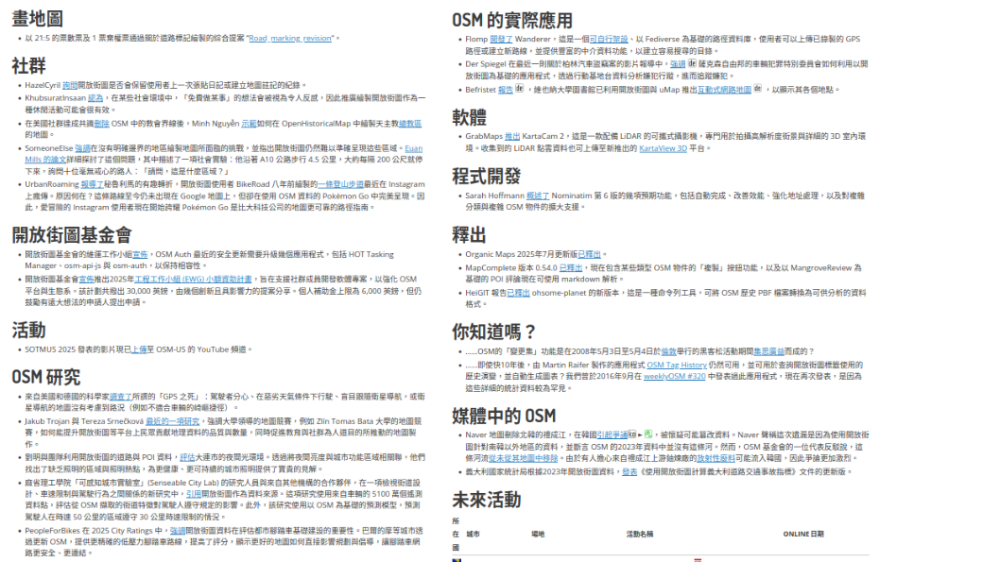

<!-- Title Slide -->
<!-- _class: gaia lead -->
<!-- _paginate: false -->
<!-- _header: '' -->
<!-- _footer: '' -->

#### Behind the Scenes of
#  weeklyOSM
#### How We Share OSM News Every Week
### Hiroshi Miura, OSM Foundation Japan

---

## Agenda
1. The fact of 780+ Weeks
2. What is weeklyOSM?
4. The Magic Behind the Curtain
5. Deep Dive: OSMBC Tool
6. My Challenge: productivity
7. Join the Story

---

<!-- 講演者紹介 -->

**Who am I**
- Hiroshi Miura
- **OpenStreetMap Japan** from 18 years ago
- Lead **developer** of translation assist application
- President of **OSM Foundation Japan**
- reach me at LinkedIn(@miurahr)

---

<!-- Opening Hook -->

### **770+ Weeks** of 
## **Never** Missing a Beat

---

---

## The Global Pulse of OpenStreetMap

- **Connecting mappers worldwide**
- **Local stories → Global impact**
- **Community heartbeat**
- **Volunteer-driven journalism**

---

---

<!-- What is weeklyOSM -->

## What is weeklyOSM?

**OSM's Weekly News Source**
- For **everyone** - beginners to experts
- **15 languages** (translation volunteers essential)
- **Independent** of organizations/companies
- **52 issues per year** (no breaks!)

**https://weeklyosm.eu/**

---

## More Than Just News

- **Community spotlight**
- **Technical developments**
- **Local mapping projects**
- **Tool announcements**
- **Event coverage**
- **Educational content**

---

---

<!-- Taiwan's Role -->

<!-- 
-->

## Taiwan's Role in the Global Story

**Small Island, Big Impact**
- Active translation team
- Local community events → international news
- Bridge between APAC communities
- Night markets to global maps

---

### The Taiwan News

**Recent Taiwan Features:**
- Local chapter proposal in #784
- Wikidata Taiwan collaboration in #763, #773
- Mapper interview in #665

*From local knowledge to global audience*

---

<!-- Technical Deep Dive -->

## Behind the Curtain

<!--
**News Collection Process**
- OSM diaries monitoring
- Community channels scanning
- Social media tracking
- Direct submissions
-->

---

## Meet OSMBC: 

### Our Secret Weapon

**OSMBC Tool Features:**
- Collaborative news collection
- Multi-language workflow
- Review system
- Publishing automation

**Live Demo Time!**

---

## **Live Demo Time!**

---

### The Weekly Workflow

---

## My challenge

### productivity

**Professional Translation Process:**
- **OmegaT** (Computer-Aided Translation)
    - (New) AI-assisted translation
    - Terminology management
    - Translation memories
    - Dictionary lookups

---

### Translation Demo

<iframe src="https://player.vimeo.com/video/1054512440?badge=0&amp;autopause=0&amp;player_id=0&amp;app_id=58479" width="700" height="390" frameborder="0" allow="autoplay; fullscreen; picture-in-picture; clipboard-write; encrypted-media" title="OSMBC Demo"></iframe>

---

<!-- Team Structure -->

## weeklyOSM Team

---

<!-- Challenges -->

## The Real Challenges

**Weekly Pressure Cooker:**

- 🕒 **Tight deadlines** - every single week
- 🌍 **Timezone coordination** across continents
- 👥 **Volunteer management** - life happens
- 🔄 **Consistent quality** with rotating contributors

---

## Community Challenges

**Human Factors:**
- **Contributor lifecycle** - onboarding to retention
- **Burnout prevention** - sustainable volunteering
- **Knowledge transfer** - preserving institutional memory
- **Quality vs. Speed** - maintaining standards under pressure

---

<!-- Looking Forward -->

## The Future

**Technology Opportunities:**
- AI-assisted translation (with human oversight)
- Team collaboration improvements

**Community Growth:**
- More regional contributors
- Topic coverage from Asia

---

## Lessons Learned

**What Works:**
✅ Consistent schedule builds habit
✅ Quality over quantity
✅ Community ownership
✅ Technical tools enable scale

---

## Lessons Learned

**What's Hard:**
❌ Sustainable volunteer engagement
❌ Priority for Life and editing
❌ Communication gaps

---

<!-- Call to Action -->

## Join the Story - Multiple Ways

**For Developers:**
- OSMBC tool improvements
- Tool to help Translation
- Mobile app development
- Analytics and metrics

---

## Join the Story

**For Writers:**
- Article writing and editing
- Community story coverage
- Translate to Chinese

---

## Join the Story

**For Taiwan Community:**
- 🇹🇼 **Translation team** - help with Traditional Chinese
- 📰 **Local news gathering** - share Taiwan OSM activities
- 🔧 **Technical contributions** - improve tools and processes
- 🎤 **Community liaison** - connect local and global stories

---

## Getting started

- Web:  https://osm.tw/
- Telegram: https://t.me/OSMTaiwan
- Facebook: https://www.facebook.com/openstreetmaptaiwan
- 📰 weeklyOSM: https://weeklyosm.eu
- State of the Map 2025, Manila: https://2025.stateofthemap.org/

---

<!-- Closing -->
<!-- _class: gaia lead -->
<!-- _paginate: false -->
<!-- _header: '' -->
<!-- _footer: '' -->

# Every Week, Every Community, Every Mapper

**Let's keep the OSM world connected**

---

<!-- Backup Slides -->

## Statistics

 - Translation Statistics after internationaled in 2014

| Language            | Contributors | Issues  | Start Date   |
|---------------------|--------------|---------|--------------|
| German              | 10           | 560+    | 2010(launch) |
| French              | 11           | 450+    | 2016.10      | 
| Japanese            | 6            | 560+    | 2014.10      |
| Traditional Chinese | 4            | 260+    | 2020.6       |

---

## Technical Stack Details

**Frontend:**
- Vue.js for reactive UI
- Bootstrap for responsive design
- Monaco Editor for code editing

**Backend:**
- Node.js with Express
- PostgreSQL for data storage
- Redis for caching

---

-